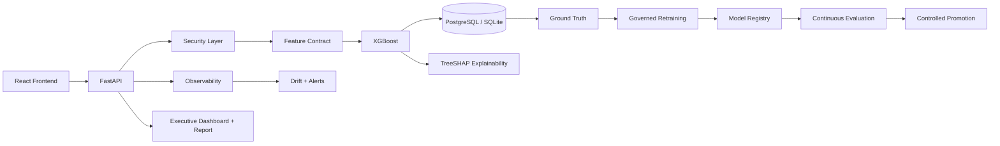
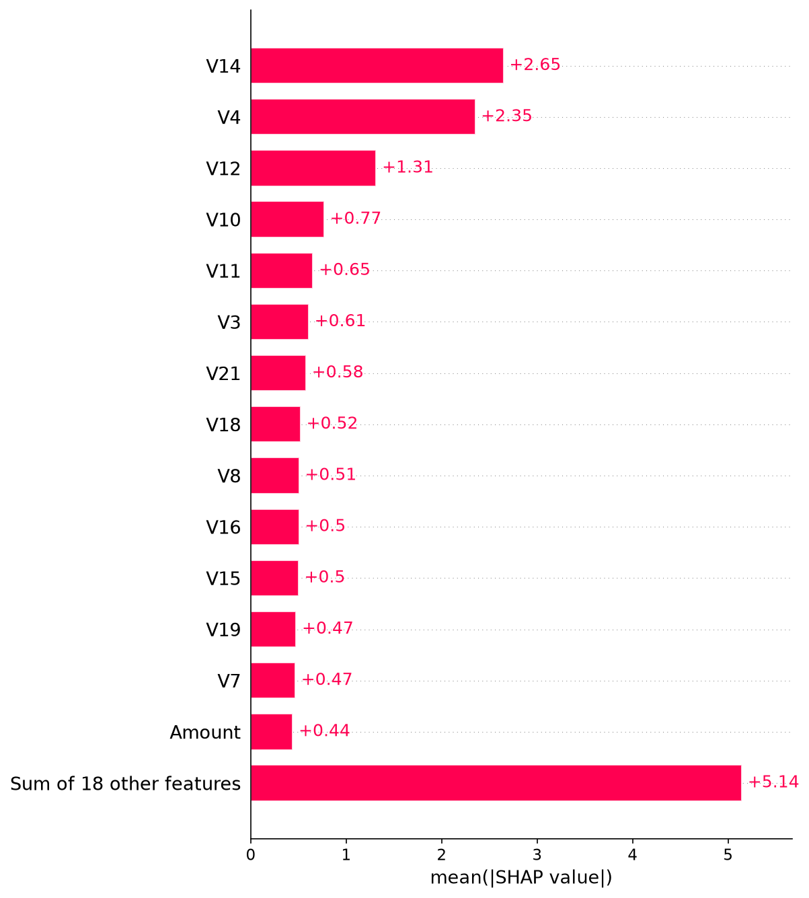
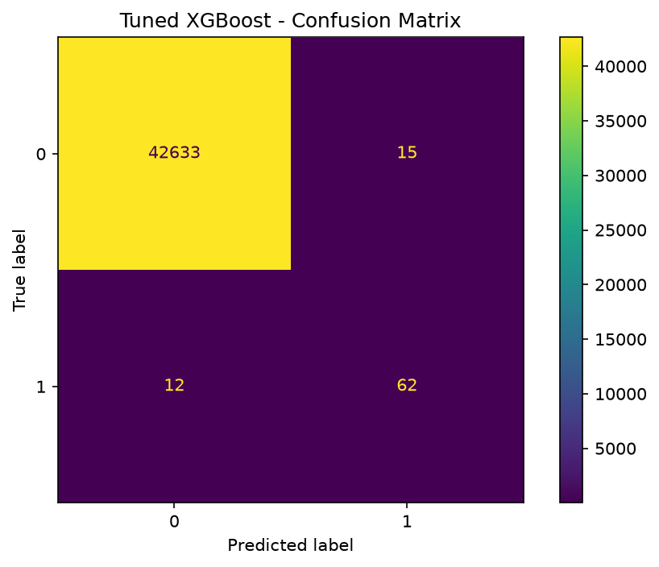
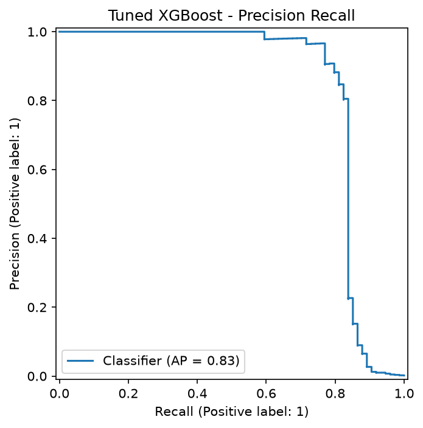
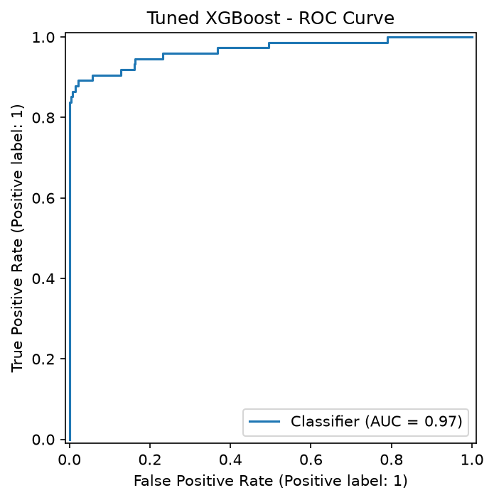

# Credit Card Fraud Detection — Production ML/MLOps System

[](https://github.com/Ronaldo94-GITHUB/credit-card-fraud-detection/actions/workflows/python-ci.yml)
[](https://github.com/Ronaldo94-GITHUB/credit-card-fraud-detection/actions/workflows/production-smoke.yml)
[](https://github.com/Ronaldo94-GITHUB/credit-card-fraud-detection/actions/workflows/continuous-model-evaluation.yml)
[](https://github.com/Ronaldo94-GITHUB/credit-card-fraud-detection/actions/workflows/feature-contract.yml)

Sistema de detecção de fraudes em cartões de crédito que evoluiu de um modelo XGBoost para uma solução completa de Machine Learning em produção, cobrindo API, banco de dados, frontend, observabilidade, drift, governança de modelos, Ground Truth, retraining, explainability, segurança, performance e CI/CD.

## Live Demo

- **Frontend:** https://credit-card-fraud-detection-frontend-k6ki.onrender.com
- **Executive MLOps Dashboard:** https://credit-card-fraud-detection-v5li.onrender.com/executive
- **Executive Report:** https://credit-card-fraud-detection-v5li.onrender.com/executive/report?period=7d
- **Backend API:** https://credit-card-fraud-detection-v5li.onrender.com
- **Swagger / OpenAPI:** https://credit-card-fraud-detection-v5li.onrender.com/docs

> Em instâncias gratuitas do Render, o primeiro acesso pode sofrer cold start.

## Visão Geral

O projeto trata um problema altamente desbalanceado de classificação binária. A solução foi estruturada para evitar depender apenas de accuracy e inclui seleção controlada de threshold, métricas adequadas ao problema, persistência de inferências, observabilidade e mecanismos de evolução segura do modelo.

### Stack

**Machine Learning:** Python · pandas · NumPy · scikit-learn · XGBoost · SHAP  
**Backend:** FastAPI · Uvicorn · PostgreSQL · SQLite  
**Frontend:** React · Vite  
**MLOps / DevOps:** Docker · GitHub Actions · Render · Model Registry · Feature Contracts · Drift Monitoring · Continuous Evaluation  
**Qualidade / Segurança:** pytest · Ruff · pip-audit · Security Hardening · Performance Gates

## Resultado do Modelo

O modelo final é um XGBoost ajustado com RandomizedSearchCV e threshold selecionado no conjunto de validação.

| Métrica | Resultado |
|---|---:|
| Precision | 80.52% |
| Recall | 83.78% |
| F1-score | 82.12% |
| F2-score | 83.11% |
| ROC-AUC | 96.69% |
| Average Precision / PR-AUC | 83.30% |
| Threshold | 0.36 |

### Matriz de confusão — holdout final

| | Previsto normal | Previsto fraude |
|---|---:|---:|
| Real normal | 42633 | 15 |
| Real fraude | 12 | 62 |

O modelo identificou 62 fraudes corretamente, com 15 falsos positivos e 12 falsos negativos no conjunto final de teste.

**Best CV Average Precision:** `0.848916`

## Fraud Operations Platform

A solução também possui uma camada operacional antifraude, conectando o score do modelo a um fluxo real de investigação.

Principais capacidades:

- classificação por faixas de risco: low, medium, high e critical;
- regras híbridas combinando ML e políticas de negócio;
- fila de casos suspeitos;
- revisão humana e Case Management;
- confirmação de fraude e falso positivo;
- Ground Truth associado às inferências;
- métricas reais de Precision, Recall, F2 e False Positive Rate;
- cálculo de exposição financeira suspeita e fraude confirmada;
- elegibilidade governada para retraining.

### Endpoints

- `GET /fraud-operations/summary?period=7d`
- `GET /fraud-operations/rules`
- `GET /fraud-operations/cases`
- `POST /fraud-operations/cases/{inference_event_id}/review`
- `GET /fraud-operations/retraining/eligibility`
- `POST /ground-truth`


## Production MLOps Architecture

### Arquitetura



Documentação detalhada: [`docs/architecture.md`](docs/architecture.md)

## Pipeline de Machine Learning

O fluxo inclui:

- validação e preparação dos dados;
- feature engineering (`Amount_log` e `Time_hours`);
- split estratificado de treino, validação e teste;
- tratamento do forte desbalanceamento de classes;
- baselines;
- tuning do XGBoost;
- otimização de threshold usando a validação;
- avaliação final no holdout;
- persistência do modelo;
- explicabilidade com SHAP.

A separação entre validação e teste evita selecionar o threshold com base no holdout final.

## Explainable AI

O projeto utiliza SHAP / TreeSHAP para interpretar previsões e identificar quais variáveis aumentam ou reduzem o risco estimado de fraude.



### Curvas e avaliação







## Production MLOps

A plataforma implementa um ciclo de vida de modelo além do treinamento inicial:

- persistência de eventos de inferência;
- métricas em memória e persistentes;
- monitoramento temporal em 24h, 7d e 30d;
- drift estatístico com PSI e KS;
- alertas MLOps;
- Model Registry com versionamento e checksum;
- Champion/Challenger;
- Continuous Evaluation;
- Controlled Promotion;
- rollback;
- Ground Truth de produção;
- métricas reais a partir de labels confirmados;
- governed retraining;
- Feature Contracts versionados;
- schema fingerprint;
- explainability em produção;
- smoke tests e monitoramento agendado.

### Princípio de governança

O projeto **não promove automaticamente** um novo modelo apenas porque ele foi treinado. Avaliação, Ground Truth, compatibilidade de features e gates de governança permanecem separados da alteração do champion em produção.

## Drift e Observabilidade

### Endpoints principais

- `GET /health`
- `GET /readiness`
- `GET /metrics`
- `GET /metrics/persistent`
- `GET /metrics/timeseries?period=7d`
- `GET /drift`
- `GET /drift/statistical?period=7d`
- `GET /alerts/mlops?period=7d`

O drift estatístico utiliza PSI e KS sobre o baseline versionado. Períodos suportados: `24h`, `7d` e `30d`.

## Ground Truth e Retraining Governado

Inferências persistidas podem receber posteriormente o label real de fraude ou não fraude. Isso permite calcular métricas de produção com dados confirmados e formar um dataset controlado para retraining.

O pipeline de retraining possui gate mínimo de elegibilidade e pode terminar com **safe skip** quando os dados são insuficientes, em vez de forçar um novo treinamento.

## Feature Governance

O Feature Contract controla:

- features de entrada;
- ordem das variáveis;
- engineered features;
- transformações;
- versão do contrato;
- fingerprint SHA-256 do schema;
- compatibilidade entre treinamento e serving.

Registro: [`models/feature_registry.json`](models/feature_registry.json)

## Model Registry

O projeto possui registro versionado de modelos com suporte a:

- registro de artefatos;
- identificação do modelo ativo;
- candidate versions;
- checksum;
- promoção controlada;
- rollback;
- histórico.

Registro: [`models/model_registry.json`](models/model_registry.json)

## Segurança

A API possui defesa em profundidade com:

- API key administrativa;
- rate limiting em `/predict`;
- Request ID;
- auditoria persistente;
- payload size limit;
- validação de `Content-Type`;
- Host header protection;
- security response headers;
- HSTS em HTTPS;
- proteção de rotas administrativas;
- dependency vulnerability audit.

Segredos não devem ser armazenados no repositório.

## Performance e Scale Readiness

O projeto mede:

- latência de inferência;
- latência HTTP;
- concorrência;
- throughput;
- error rate;
- p50;
- p95;
- p99.

Os testes de carga automatizados usam uma instância **local** da API para evitar gerar carga intencional sobre o deploy público. Os resultados são tratados como gates de regressão, não como garantia absoluta de capacidade produtiva.

## Executive MLOps Dashboard

O dashboard executivo simplifica a apresentação do sistema para liderança, recrutadores e stakeholders.

**Rota:** `/executive`

Inclui:

- modelo ativo;
- volume de inferências;
- taxa prevista de fraude;
- latência;
- drift;
- alertas;
- Ground Truth;
- performance;
- governança;
- recomendação executiva;
- tendências de inferências, latência e fraude prevista.

## Executive Report / PDF

**Rota:** `/executive/report?period=7d`

O relatório possui layout A4 e gráficos SVG. Para exportar:

`Gerar PDF → Salvar como PDF`

A página usa dados agregados e não exibe o payload completo de transações individuais.

## External MLOps Alerts

A infraestrutura está preparada para alertas externos `warning` e `critical` via webhook genérico / Slack-compatible webhook.

A configuração usa secrets externos como `MLOPS_ALERT_WEBHOOK_URL`; nenhum webhook secreto é armazenado no código. Quando não configurado, o mecanismo permanece seguro e desativado.

## CI/CD e Quality Gates

GitHub Actions cobre diferentes áreas do projeto, incluindo:

- backend quality;
- frontend quality;
- Docker build;
- Ruff;
- pytest;
- pip-audit;
- feature contract;
- explainability;
- security hardening;
- production smoke tests;
- scheduled monitoring;
- retraining pipeline;
- performance gates;
- external MLOps alert checks.

## API de Predição

### `POST /predict`

Exemplo de resposta:

```json
{
  "fraud_probability": 0.87,
  "fraud_prediction": 1,
  "risk_label": "suspeita",
  "model_name": "tuned_xgboost",
  "threshold": 0.36
}
```

A documentação completa pode ser explorada no Swagger em `/docs`.

## Execução Local

```powershell
python -m venv .venv
.\.venv\Scripts\Activate.ps1
python -m pip install -r requirements.txt
python -m pytest -q
uvicorn src.api:app --reload
```

## Documentação Técnica

- [`docs/architecture.md`](docs/architecture.md)
- [`docs/mlops-lifecycle.md`](docs/mlops-lifecycle.md)
- [`docs/portfolio-case-study.md`](docs/portfolio-case-study.md)
- [`docs/model-registry-runbook.md`](docs/model-registry-runbook.md)
- [`docs/continuous-model-evaluation.md`](docs/continuous-model-evaluation.md)
- [`docs/production-retraining.md`](docs/production-retraining.md)
- [`docs/feature-store.md`](docs/feature-store.md)
- [`docs/production-explainability.md`](docs/production-explainability.md)
- [`docs/security-hardening.md`](docs/security-hardening.md)
- [`docs/performance-scale-readiness.md`](docs/performance-scale-readiness.md)
- [`docs/executive-dashboard.md`](docs/executive-dashboard.md)
- [`docs/executive-analytics-alerts.md`](docs/executive-analytics-alerts.md)

## O que este projeto demonstra

Este projeto foi desenvolvido como um case de **Machine Learning Engineering / MLOps** e demonstra experiência prática em:

`Machine Learning` · `XGBoost` · `Python` · `FastAPI` · `PostgreSQL` · `React` · `Explainable AI` · `MLOps` · `Model Governance` · `Observability` · `Drift Detection` · `Security` · `Docker` · `CI/CD` · `Performance Engineering`

## Autor
**Ronaldo Augusto Sabino**
**Rogério Augusto Sabino**

Projeto de portfólio focado em Machine Learning Engineering, MLOps e sistemas de IA em produção.
